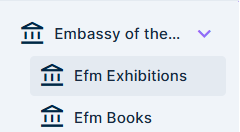
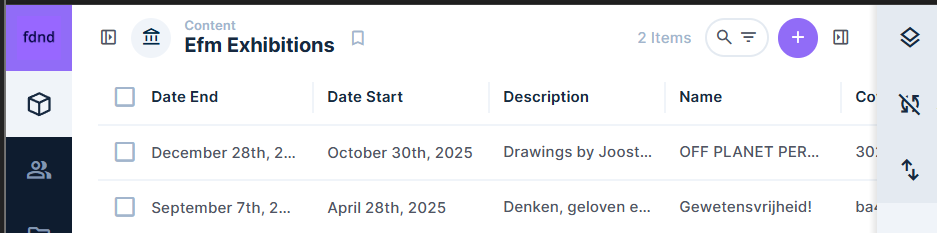
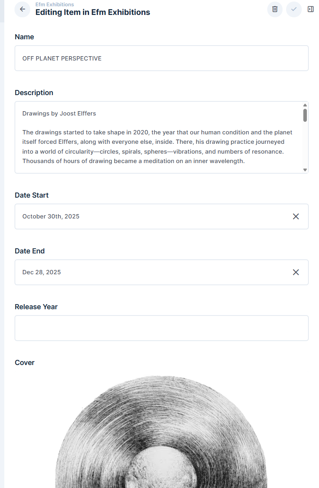
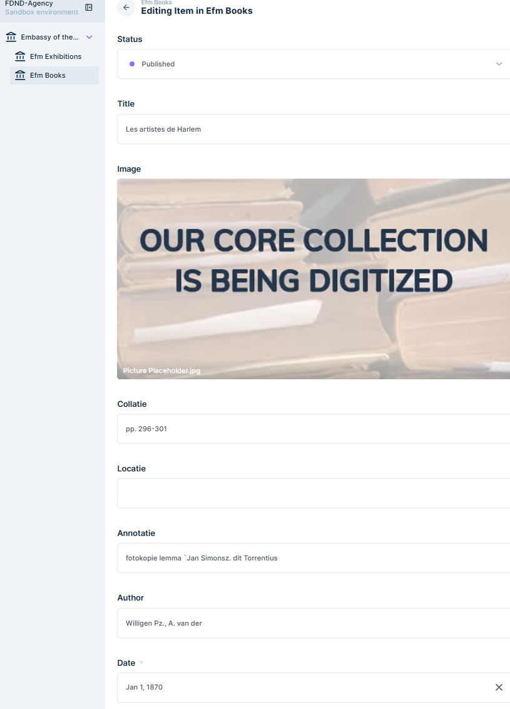

# Technical Documentation

## Code Structure
The project follows a modular architecture designed for maintainability and scalability.
- **Components**: We strive to create as many reusable components as possible. Following our coding conventions, class names and component files use **kebab-case**.
- **Conventions**: We adhere (mostly) to the FDND code conventions, ensuring consistent formatting, whitespace usage, and commenting. (prettier enabled)

## Data Model
A complete data model has been designed to structure the information within the application.

> **Note:** Currently, we are only utilizing the data from the database for the **Exhibitions** page. While the model exists for the broader system, the active implementation of database retrieval is currently focused on this specific section.

## Important Components
Components are the building blocks of our application.
- **Functionality**: Each component encapsulates its own logic and styling to ensure separation of concerns.
- **Interaction**: Components communicate via props and events to maintain a clear data flow.

## CMS Configuration
The content is managed via a CMS (Directus) to allow for easy updates without code changes.
- **Content Types**: Custom content types are defined in the CMS to match our data model (e.g., Exhibitions).
- **Front-end Connection**: The front-end fetches content via the CMS API.

## API Documentation
We primarily interact with the CMS API.
- **Endpoints**: Used to retrieve content for pages such as the Exhibitions overview.

## Environment Variables
To run the project locally, you currently **do not** need to configure environment variables.

The application fetches data from a public API endpoint. If authentication or private endpoints are added in the future, an `.env` file will be required.

so for future use you need to:

- **`example.env`**: This file contains the list of required variables without sensitive values.
- **Setup**: Duplicate `example.env` to a new file named `.env`.
- **Credentials**: Ask the project lead (or Joost) for the actual values to fill in your `.env` file.
- **make changes** Ask for the project lead for the directus admin login if you want to add things to Directus yourself.

